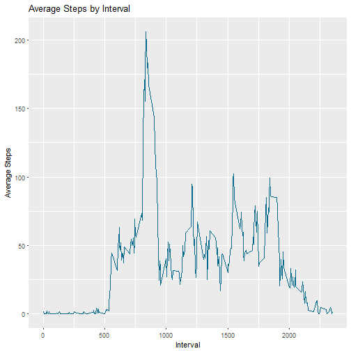
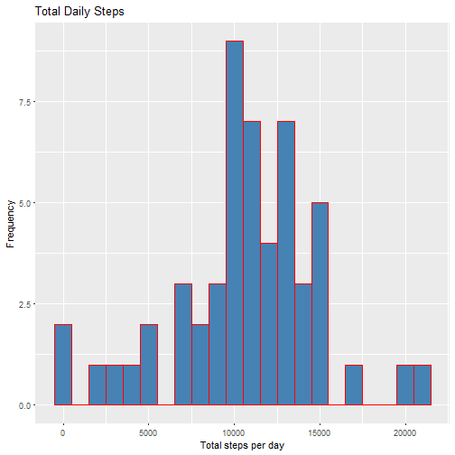
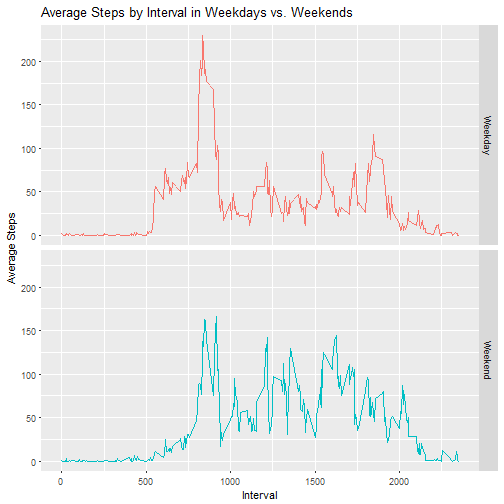

# Reproducible Research - Week 2 Project

### 1. Reading the dataset

Import needed libraries

```r
library(ggplot2)
```

Unzip the file, and load using read.csv()

```r
filename <- "activity.csv"
if (!exists(filename)) unzip("activity.zip")
fileData <- read.csv(filename)
```

### 2. Histogram of the total number of steps taken each day

Summarize the data; sum the steps by date ignoring NA values

```r
stepsSumByDate <- aggregate(steps ~ date, fileData, sum)
```

Plot a histogram of the steps from the aggregated data.frame

```r
ggplot(stepsSumByDate, aes(steps)) +
       geom_histogram(fill = "steelblue", col = "red", binwidth = 1000) +
       labs(x = "Total steps per day", y = "Frequency") +
       labs(title = "Total Daily Steps")
```


### 3. Mean and median number of steps taken each day


```r
mean(stepsSumByDate$steps)
```

```
## [1] 10766.19
```


```r
median(stepsSumByDate$steps)
```

```
## [1] 10765
```

### 4. Time series plot of the average number of steps taken

Summarize the data; average of the steps by interval ignoring NA values

```r
meanStepsByInterval <- aggregate(steps ~ interval, fileData, mean)
```

Plot (line) of the aggregated data.frame

```r
ggplot(meanStepsByInterval, aes(interval, steps)) +
       geom_line(col = "deepskyblue4") +
       labs(x = "Interval", y = "Average Steps") +
       labs(title = "Average Steps by Interval")
```



### 5. The 5-minute interval that, on average, contains the maximum number of steps


```r
meanStepsByInterval[which.max(meanStepsByInterval$steps),]
```

```
##     interval    steps
## 104      835 206.1698
```

### 6. Code to describe and show a strategy for imputing missing data

Calculate and report the total number of missing values in the dataset (i.e. the total number of rows with NAs)

```r
sum(is.na(fileData$steps))
```

```
## [1] 2304
```

Devise a strategy for filling in all of the missing values in the dataset. The strategy does not need to be sophisticated. For example, you could use the mean/median for that day, or the mean for that 5-minute interval, etc.
Create a new dataset that is equal to the original dataset but with the missing data filled in.

```r
imputeFileData <- fileData
for (i in 1:nrow(imputeFileData)){
  if (is.na(imputeFileData$steps[i])){
    imputeFileData$steps[i] <-
      meanStepsByInterval[which(imputeFileData$interval[i] ==
                                  meanStepsByInterval$interval),]$steps
  }
}
```

### 7. Histogram of the total number of steps taken each day after missing values are imputed

Make a histogram of the total number of steps taken each day and Calculate and report the mean and median total number of steps taken per day.

```r
imputeStepsSumByDate <- aggregate(steps ~ date, imputeFileData, sum)
ggplot(stepsSumByDate, aes(steps)) +
       geom_histogram(fill = "steelblue", col = "red", binwidth = 1000) +
       labs(x = "Total steps per day", y = "Frequency") +
       labs(title = "Total Daily Steps")
```




```r
mean(imputeStepsSumByDate$steps)
```

```
## [1] 10766.19
```


```r
median(imputeStepsSumByDate$steps)
```

```
## [1] 10766.19
```

Do these values differ from the estimates from the first part of the assignment? What is the impact of imputing missing data on the estimates of the total daily number of steps?

```r
print(paste("Original mean:", mean(stepsSumByDate$steps),
            "vs. New mean:", mean(imputeStepsSumByDate$steps)))
```

```
## [1] "Original mean: 10766.1886792453 vs. New mean: 10766.1886792453"
```


```r
print(paste("Original median:", median(stepsSumByDate$steps),
            "vs. New median:", median(imputeStepsSumByDate$steps)))
```

```
## [1] "Original median: 10765 vs. New median: 10766.1886792453"
```

### 8. Panel plot comparing the average number of steps taken per 5-minute interval across weekdays and weekends

Create a new factor variable in the dataset with two levels - "weekday" and "weekend" indicating whether a given date is a weekday or weekend day.


```r
imputeFileData$day <- factor(weekdays(as.Date(
                              as.character(imputeFileData$date))))
levels(imputeFileData$day) <- list(Weekday = c("Monday", "Tuesday",
                                               "Wednesday", "Thursday",
                                               "Friday"),
                                   Weekend = c("Saturday", "Sunday"))
```

Make a panel plot containing a time series plot (i.e. type = "l") of the 5-minute interval (x-axis) and the average number of steps taken, averaged across all weekday days or weekend days (y-axis).

Summarize the data; average the steps over weekdays/weekends and intervals

```r
meanImputeStepsByInterval <- aggregate(steps ~ day + interval, imputeFileData, mean)
```

Plot (line) of the aggregated data.frame

```r
ggplot(meanImputeStepsByInterval, aes(interval, steps, col = day)) +
       geom_line() +
       facet_grid(day ~ .) +
       guides(col = FALSE) +
       labs(x = "Interval", y = "Average Steps") +
       labs(title = "Average Steps by Interval in Weekdays vs. Weekends")
```


